# Homework 1
Author: Aaron Lim

Date: 29 September 2020

# Your DSP Experience

## On the project you are currently doing:

### What Signal Processing is being done?
**NOTE:** If there is no DSP on your project, go ask about a different project.

Lots of signal processing, filtering, rate conversion, modulation, demodulation, carrier recovery, correlation; you name it.

### What DSP hardware?  FPGA? DSP? PC? Etc.
I have seen projects use any and all of those options. FPGA's are popular because they are fast, but processing on a PC is also useful to decrease development time.

### Which ADC and DAC?  How many bits?  What is the sample rate?
There's a small software defined radio (SDR) that I often use, which contains two transceiver IC's. Each uses a 12-bit ADC and samples at 60MSps. In addition, there is an arbitrary waveform generator block in firmware thata contains several bypassable upsampling filters, allowing you to take in data at a few other rates less than 60MSps.

# Sampling

## Using either Matlab, Simulink, or Python

### Create a signal composed of multiple sinusoids of different frequencies
The signal chosen is composed of three complex sinusoids at frequencies:
- f1 = 100 Hz
- f2 = 200 Hz
- f3 = 300 Hz

### Sample this signal at different sampling rates
##### Sampling at 450Sps (1.5x fmax)
Note the 300Hz component has been aliased.

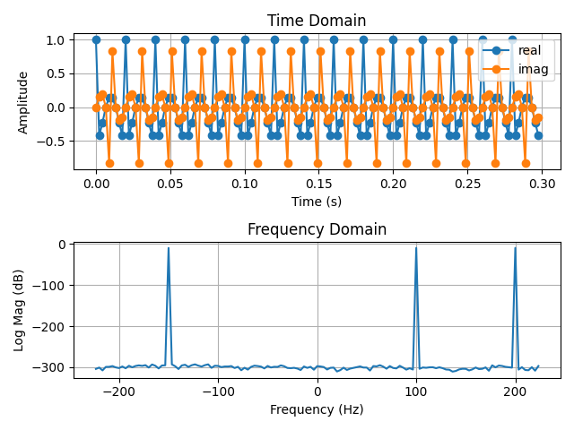

##### Sampling at 600Sps (2x fmax)
Note the 300Hz componoent is at the very edge of the band, and due to the limited FFT resolution, it appears at -300Hz.

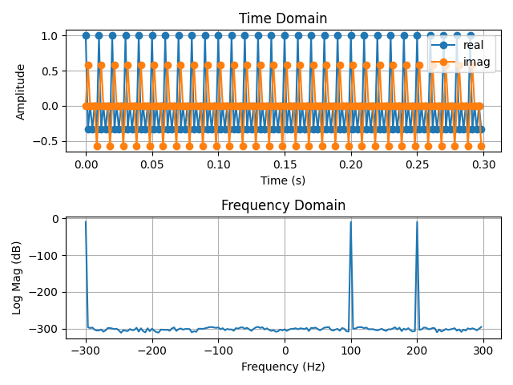

##### Sampling at 610Sps (2.03x fmax)
Note that no aliasing occurs, but with very little margin for frequency error.

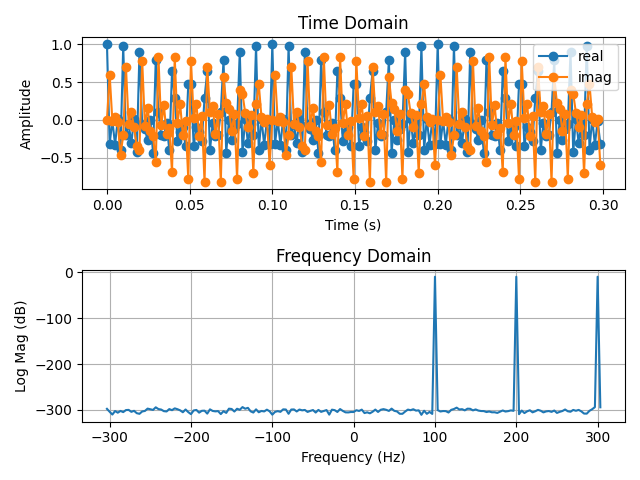

##### Sampling at 3000Sps (10x fmax)
Note that aliasing does not occur, and there is a lot of margin for frequency error.

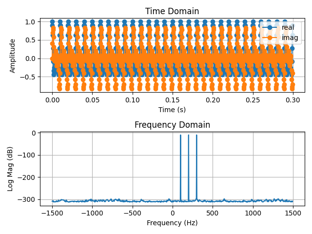

#### What is the minimum sampling rate allowed?
The data shows that to prevent aliasing, the sample rate of your system must be greater than twice the highest frequency of the received signal. This is known as the Nyquist Criterion.

Nyquist Criterion: fs > 2fmax

Real systems must account for nonidealities in their hardware, which can lead to frequency errors. It is important to operate well above the Nyquist rate.

# Quantization

### Quantize the signal, using quantizing levels (i.e. different numbers of bits)
Signals were quantized using a mid-rise quantizer, with levels:

-A + D/2 + D .* (0, 1, 2, ..., q-1)

Where:
A = Full Scale Amplitude
q = number of levels = 2num_bits
D = The distane between levels = 2A / q
.* = point-wise multiplication operator

Becuase the signal under test is complex, the real and imaginary (I and Q) data streams were quantized seperately.

#### Analyze the spectrum of the signal

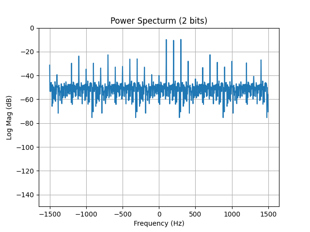

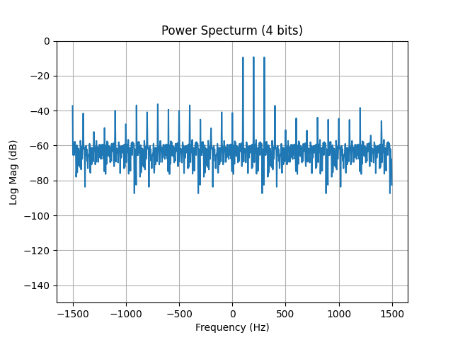

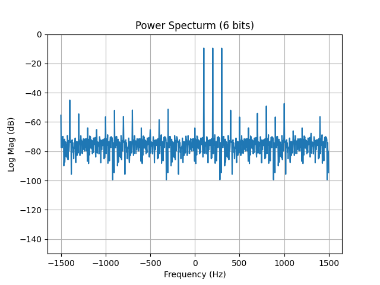

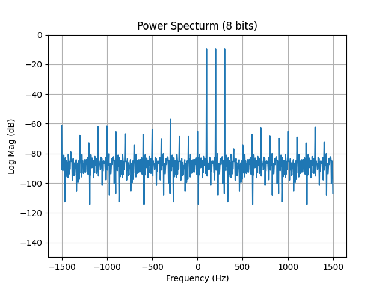

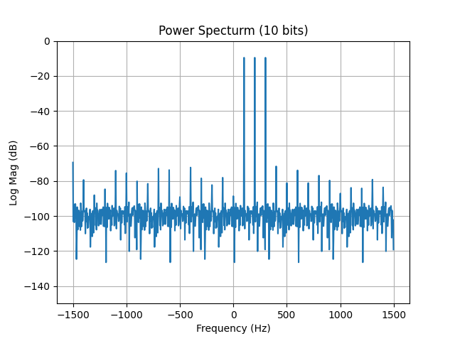

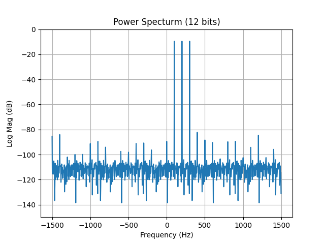

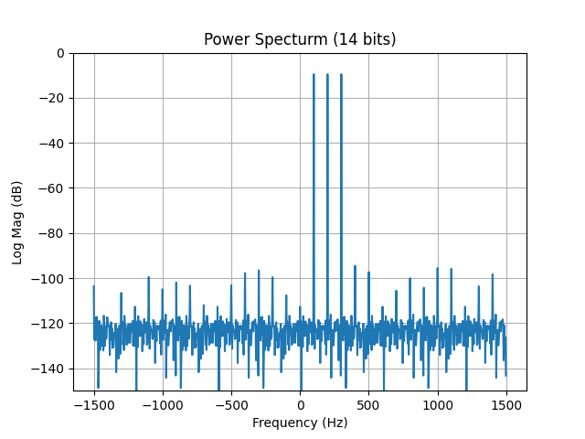

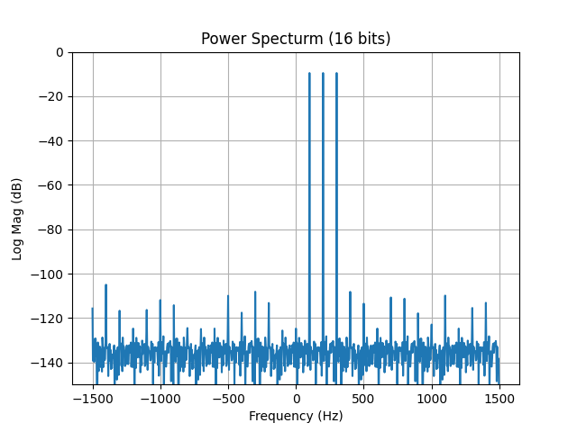

#### How does the quantizing level affect the noise floor of the spectrum?

It is clear from the plots that more bits leads to a lower noise floor.

#### For each new bit added, how much does the noise floor decrease?

Quantization noise was measured as:

Noise Signal = Pure Signal - Quantized Signal

Power for both the pure and noise signals was measured as:

P = sum( |x|2 )

And Signal to Quantization Noise Ratio (SQNR) was measured as the ratio of the power of the pure signal to the power of the quantizaiton noise.

SQNR = Ps / Pn

SQNRdB = 10Log10(SQNR)

In DSP literature it is common to estimate the SQNR of a quantized full-scale sine wave as:

SQNRdB = 1.76 + 6.02b [dB]

Where b is the number of bits.

Both my data and the theoretical data are provided in the plot below.

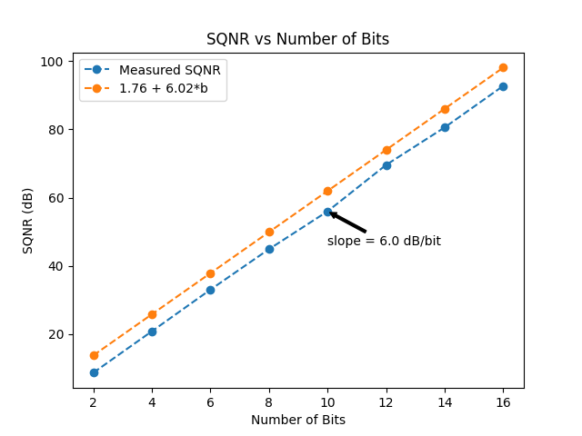

For each bit added, the quantization noise increases by approximately 6dB.
