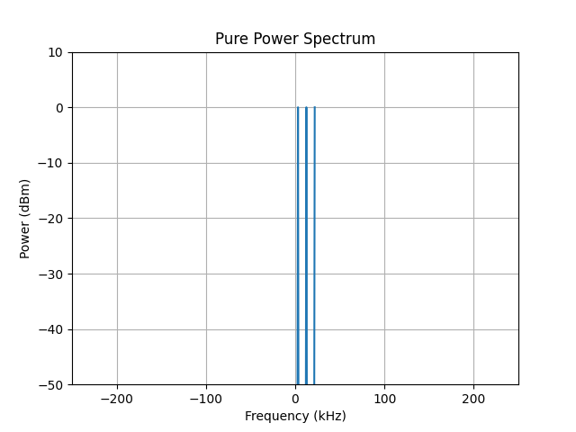
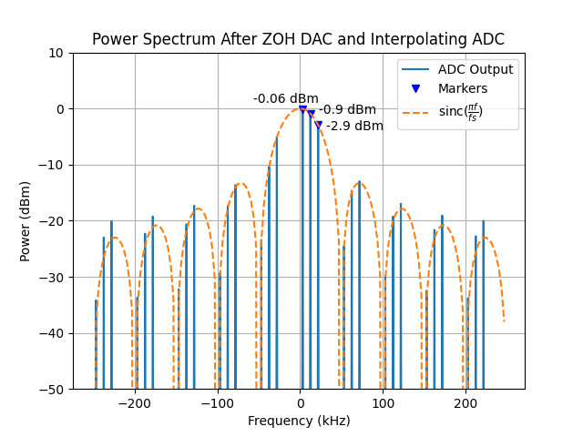
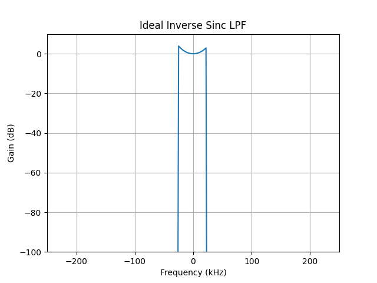

# Applied DSP - Homework 2
Aaron Lim - 6 October 2020

## Background
In the real world, we have to deal with the limitations of practical devices. Practical DACs do not generate Dirac pulse train outputs. Instead, they generate analog signals using a Zero-Order Hold approach. With a Zero-Order Hold, each sample is held for the duration of the sample period. This causes what is known as sinc-rolloff to occur in the generated signal. In this homework assignment, you will investigate this phenomenon.

## Setup
Use your choice of software to generate a test signal consisting of the sum of three real sinusoids of the same amplitude. All three sinusoids should be of the same length.

The first sinusoid should have a frequency of $\frac{1}{16}f_s$. The second should have a frequency of $\frac{1}{4}f_s$. The third should have a frequency of $\frac{7}{16}f_s$.

[//]: # (The following is only used to generate the PDF)

[//]: # (The first sinusoid should have a frequency of fs/16 The second should have a frequency of fs/4. The third should have a frequency of 7fs/16.)

Simulate the Zero-Order Hold of a DAC by repeating each sample 10 times. This is roughly equivalent to generating an analog signal using a DAC, and then sampling that signal with an ADC running at 10x the sample rate.

Use an FFT to examine the signal in the frequency domain.

## Questions
#### What happens to the relative amplitudes of the three sinusoids within the Nyquist region of the DAC?

The figure below shows the signal under test prior to being sent through the DAC. The sample rate is 50kHz and the three tones appear at 3.125kHZ, 12.5kHz, and 21.875kHz.

    
    

        Figure 1. Pure Spectrum
    

The zero-order hold function of the DAC acts like a channel with a rectangle impulse response. The fourier transform pair of the rectangle function is a sinc function, leading to the sinc-rolloff seen in the figure below.

    
    

        Figure 2. Effects of DAC and ADC
    

#### How many times are the three sinusoids repeated in the frequency domain? Why is that? What must follow the DAC?

The ADC with upsample factor 10 causes 9 images, which in addition to the original signal, totals 10 copies of our signal under test. This can be seen in Figure 2 shown above.

Why the images occur is an interesting question. I like to think that the images are always there, but are just indistinguishable from the original signal using the original sample rate (i.e. all images fold or alias into the same spot). However, when we upsample, the sample rate increases, giving room for the images to fold into a new spot.

In order to remove these images, we need a lowpass filter where the bandwidth of the passband is the original sample rate or less.

#### What techniques might we use to generate a higher- fidelity signal out of the DAC?

To combat sinc roll-off from the DAC we can add an equalizing stage that's gain response is the inverse sinc function. For this homework, I opted to combine the equalizer with the lowpass filter needed to remove spectral images. The figure below shows an ideal lowpass filter that's passband is 50kHz (the sample rate of our original signal) and that's gain response is the inverse sinc function.

    
    

        Figure 3. Ideal Inverse Sinc LPF
    

Applying this ideal equalizing lowpass filter to the signal in Figure 2 removes the sinc roll-off and images allowing us to recover the original signal at a higher sample rate.

    
    

        Figure 4. Equalized Signal
    

