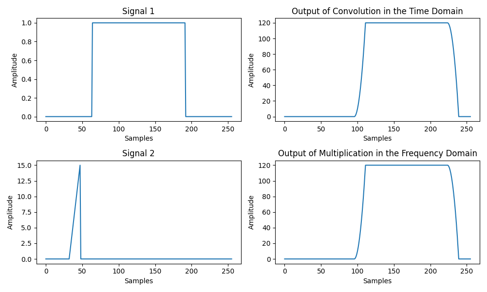

# Applied DSP - Homework 3
Aaron Lim - 13 October 2020

# Fourier Transforms

## Calculate and plot spectrum of delta, rect, and comb functions

The figure below shows the fourier transform pairs of three fundamental functions, the kronecker delta, the rectangle function, and the dirac comb.

The Fourier transform of the kronecker delta is a signal with "infinite" bandwidth. Because our signal is limited in time, the Fourier transform is limited in bandwidth. Energy is distributed equally among all frequency bins, meaning each has an amplitude of 1/N = 1/256 = 0.00391.

The Fourier transform of the rectangle function is a sinc function. The longer the pulse width of our rectangle, the narrower the sinc function becomes. And visa versa, the narrower the rectangle function becomes, the wider the sinc function gets.

Lastly, the Fourier transform of the dirac comb is another dirac comb, however the spacing between delta functions in the frequency domain is proportional to the reciprocal of the spacing between delta functions in the time domain. One can verify this by altering the python script to show an interactive plot. By zooming into the plot of the Fourier transform of the dirac comb, one can see that the spacing between delta functions is 4 samples which is equal to the signal length divided by the delta function spacing in the time domain (4 = 256 / 64).

<p align="center">
    
</p>

## Compare convolution in time domain with convolution in freq domain (They should be the same)

As the figure below shows, convolving in the time domain gives the exact same result as multiplying in the frequency domain. This was also verified using the allclose() function in numpy, which returns true if all values between two arrays are within a tolerance (which defaults to 1e-5).

```
> # frequency domain multiplication
> rf = ifft(fft(x1) * fft(x2))
> # time domain convolution truncated to
> # match the length of rf
> rc = convolve(x1, x2)[:len(rf)]
> np.allclose(rc, rf)
True
```

<p align="center">
    
</p>

#### Measure time spent on each function. Does processing time change with length of signals?

Python's timeit() function was used to measure the processing time of convolution in the time domain and multiplication in the frequency domain using the numpy library. Several array lengths were tested, with a mix of powers of 2 and non-powers of 2. Each array length was measured over 1000 trials. The figure below shows that multiplying in the frequency domain is an order of magnitude faster than convolution for large array sizes.

<p align="center">
    
</p>
