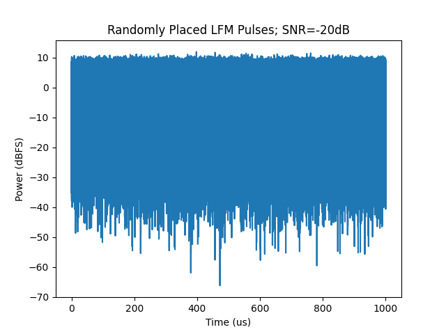

# Applied DSP - Homework 4
Aaron Lim - 20 October 2020

# Background
Advances in ADC designs now make it possible to perform direct sampling of RF signals. Your homework assignment is to generate simulated receive data for an L-band (1-2 GHz) radar direct-sampled at 5 GSps, digitally demodulate it, and perform pulse compression.  You can use floating-point samples for this assignment.  You may work in small teams.

# Tasks

## Step 1
Generate 1 ms worth of pseudo-random noise data at 5 GSps.  This data should have a normal distribution (for instance, use randn() in MATLAB).

## Response 1
A 1ms vector of complex noise was generated using the *normal* function in the numpy library. The random number generator was instantiated with a seed value for repeatability. This noise by default has a mean of 0 and a standard deviation of 1.

    T = 1e-3 # seconds
    fs = 5e9 # Sps
    N = round(T * fs) # number of samples
    seed = 123
    rng = numpy.random.default_rng(seed)
    noise = rng.normal(N) + 1j*rng.normal(N)

## Step 2
Generate an LFM pulse (see last slide) with a pulse width of 10 μs and a bandwidth of 8 MHz at your choice of center frequency in L-Band (1-2 GHz), sampled at 5 GSPS.  Add several copies of this waveform to the noise data at random times.  The amplitude of the LFM pulses should be less than the standard deviation of the noise data, so that they are obscured by the noise.

## Response 2
The figures below show a linear frequency modulated chirp (LFM) at baseband and modulated to 1250MHz respectively. The choice of carrier frequency will come into play later in this report. The amplitude of the LFM was adjusted to meet an SNR of -20dB relative to the noise vector from step 1.

    

    

The LFM was replicated and randomly shifted in time before being added to the noise vector from step 1. Due to the very low SNR, the LFM pulses are not easily visible.

    

## Step 3
Write code to digitally demodulate the data to baseband and perform low-pass filtering.  (In other words, process the data into a quadrature signal).  Decimate the results to 10 MSPS.  (Hint: you may want to filter and decimate the signal in stages).

## Response 3
Four stages were used to demodulate the signal, with decimation factors of 4, 5, 5, and 5.

Using multiple stages relaxes the constraints of the filter used in each stage.

Two filters were designed, one for the decimation by 4 stage and one for the remaining three decimation by 5 stages.

**Filter used to decimate by 4**

| Parameter     | Value Requested  |
| ------------- | ---------------- |
| Design Method | Window - Hamming |
| Filter Type   | FIR - Lowpass    |
| No. Taps      | 64               |
| Bandwidth     | fs / 4 = 1.25GHz |
| Transition    | fs / 5000 = 1MHz |

    

The carrier frequency was purposefully chosen as one quarter of the sample rate (fc = fs/4), which simplifies the first decimation stage in two ways.

First, the output of an oscillator operating at fs/4 will be the sequence [ 1, 1j, -1, -1j ]. This means we can turn our lowpass filter into a bandpass filter just by taking the real or imaginary part of the coefficient and changing its sign according to that pattern.

Second, there is no need to mix the signal down to baseband. Decimating by 4 causes the signal to alias to baseband.

**Filter used to decimate by 5**

| Parameter     | Value            |
| ------------- | ---------------- |
| Design Method | Window - Hamming |
| Filter Type   | FIR - Lowpass    |
| No. Taps      | 64               |
| Bandwidth     | fs / 5           |
| Transition    | fs / 20          |

    

## Step 4
Cross-correlate the quadrature data with a baseband version of the radar pulse.  This is known as pulse compression.

## Response 4
A new LFM was generated at the final sample rate of 10MSps. This waveform was cross correlated with the demodulated signal. Results are shown in the figure below.

    

# Questions

### What bandwidth did you use for the low-pass filter(s)?  Why?

As shown in [response 3](#response-3) above, 4 filter/decimation stages were used but only 2 filters were needed. One was used to decimate by 4 once, and one was used to decimate by 5 three times.

The filter used to decimate by 4 had a bandwidth of fs/4 (1.25 GHz). This was the largest bandwidth that would prevent the aliasing of unwanted images. It would be easy create a very tight 8MHz filter using hundreds of taps, but that may not be realistic for some systems. The larger bandwidth allowed for a low number of filter taps.

Similarly, the filter used in each decimation by 5 stage had a normalized bandwidth of 1/5. This way, at each of the three decimation stages the filter would have a bandwidth of fs/5. Again, this is the largest bandwidth that could prevent aliasing after decimation.

### What happens to the ratio of the signal power to the noise power (Signal-To-Noise Ratio, or SNR) after low-pass filtering?  Why is that the case?

Ideally, digital filtering increases or maintains the signal power while attenuating noise power. Because the noise power decreases after filtering, SNR increases. This can be seen in the figure from [response 4](#response-4).

### What happens to the SNR after pulse compression?

Because our noise is uncorrelated, there is no chance that correlating against an LFM would result in a high value, meaning only the portions of the received data that contain the LFM pulse will produce a high correlation value. Consequently, SNR skyrockets, allowing us to detect signals far under the noise.

### What happens to the shape of the signal envelope (i.e. its magnitude) after pulse compression?

The output of the pulse compression stage is a sharp point, almost like a narrow triangle or even an impulse, at the start of each LFM. Like its name suggests, the pulse has been compressed in time. This can be seen in the figure from [response 4](#response-4).

### Why do you think pulse compression is useful in a radar system?

Pulse compression drastically increases the SNR of the received signal, allowing systems to detect signals very far under the noise. This effectively increases the detection range of a system. Increasing SNR is especially important for radar systems as radar pulses travel out to targets **and back**, resulting in extra propagation loss and very low received signal levels.

# Notes
The standard deviation of the pseudo-random numbers generated by MATLAB’s randn() function is 1.  In other words, s*randn(..) has a standard deviation of s.  When we use randn() to generate noise, the noise power is equal to the variance.  The variance is equal to s^2.

To design a low-pass filter, you can use MATLAB’s Filter Design and Analysis tool by running the command fdatool.  Be sure to close MATLAB when you are done, since this uses a Signal Processing Toolbox license!  For this exercise, I would recommend you use FIR filters.  You can apply a FIR filter by convolving the signal with the filter coefficients.

Decimation means to throw away data.  For instance, when you decimate by 4, you simply keep every 4th sample.  This reduces the sample rate by a factor of 4.
